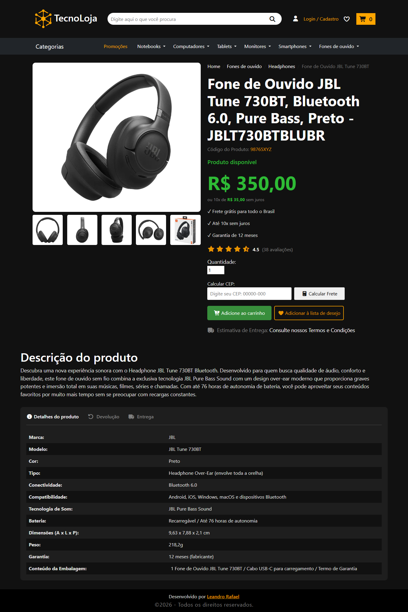
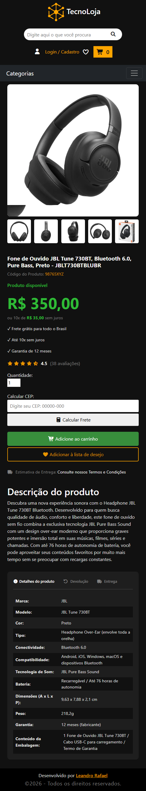

<div align ="center">

# Página de Produto Otimizada <br> para E-commerce com Foco em SEO

</div>

Projeto de uma página de produto (PDP) para e-commerce com foco em SEO, CRO e performance. Aplica boas práticas como HTML semântico, URLs amigáveis, Sitemap.xml, Robots.txt e Schema Product, simulando um cenário real de otimização para mecanismos de busca e conversão.

- Demo: [Clique aqui para ver esse projeto](https://leandrorafael-io.github.io/pagina-de-produto-otimizada-com-foco-em-seo-para-ecommerce/)

## 🖥️ Desktop:
<div align="left">
    
</div>

## 📱 Mobile:
<div align="left">
    
</div>

## 🔍 Técnicas de SEO aplicadas:
- URLs amigáveis
- Sitemap.xml
- Robots.txt
- Schema Product
- HTML Semântico
- Estrutura de Heading Hierarchy

## 📊 Técnicas de CRO aplicadas:
- Zoom de produto
- Galeria de imagens
- Contador de carrinho
- Lista de favoritos
- Destaque para CTA
- Organização visual das informações

## ⚡ Otimizações de Performance:
- Imagens otimizadas
- Redução de requisições HTTP
- CSS minimizado
- Carregamento eficiente de recursos

## ⚙️ Funcionalidades Criadas para esse projeto:
- Galeria de imagens
- Zoom de produto
- Contador de carrinho
- Lista de favoritos
- Tabs de especificações
- Footer dinâmico

## 🛠️Tecnologias que utilizei:
Esse projeto foi desenvolvido com as seguintes tecnologias:
* HTML5
* CSS3
* Bootstrap 5
* JavaScript

## 🚀 Como usar:
Clone o repositório abaixo:
```
git clone https://github.com/leandrorafael-io/pagina-de-produto-otimizada-com-foco-em-seo-para-ecommerce
```

## Autor:


### Leandro Rafael
[](https://www.linkedin.com/in/leandrorafael-io/) [](https://instagram.com/leandrorafa3l)
 
## Licença:
[](https://opensource.org/licenses/MIT)

Este projeto está sob licença do MIT. Veja a licença para mais informações:

[Veja o Copyright](https://github.com/leandrorafael-io/pagina-de-produto-otimizada-com-foco-em-seo-para-ecommerce/blob/main/LICENSE)